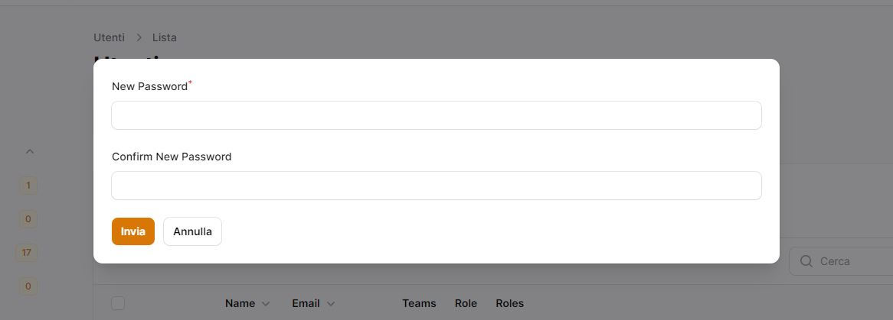
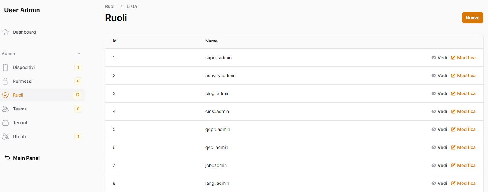

# Module users
Gestione degli utenti, ruoli, permessi.

## Screenshots





## Aggiungere Modulo nella base
Dentro la cartella laravel/Modules

```bash
git submodule add https://github.com/laraxot/module_user_fila3.git User
```

## Verificare che il modulo sia attivo
```bash
php artisan module:list
```
in caso abilitarlo
```bash
php artisan module:enable User
```
