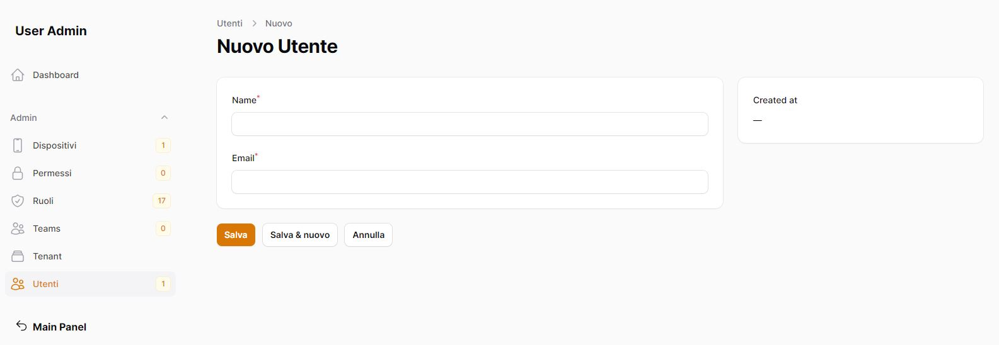

# Module users
Gestione degli utenti, ruoli, permessi tramite l'utilizzo di filament.

## Gestione degli utenti




## Gestione dei ruoli


## Aggiungere Modulo nella base del progetto
Dentro la cartella laravel/Modules

```bash
git submodule add https://github.com/laraxot/module_user_fila3.git User
```

## Verificare che il modulo sia attivo
```bash
php artisan module:list
```
in caso abilitarlo
```bash
php artisan module:enable User
```

## Eseguire le migrazioni
```bash
php artisan module:migrate User
```

## Creare il primo account
Dalla documentazione di filament utilizziamo:
```bash
php artisan make:filament-user
```
l'account non potrà visualizzare nulla nella dashboard di amministrazione, in quanto non avrà assegnato nessun ruolo.

## Rendere un account Super Admin
```bash
php artisan user:super-admin
```
Ora avete il vostro account Super Admin per poter iniziare.
Esso potrà accedere a tutti i moduli nell'amminstrazione.

## Assegnare un ruolo/modulo
```bash
php artisan user:assign-module
```
L'account potrà accedere al modulo assegnato.

## [Gestione dei Team](docs/teams.md)
